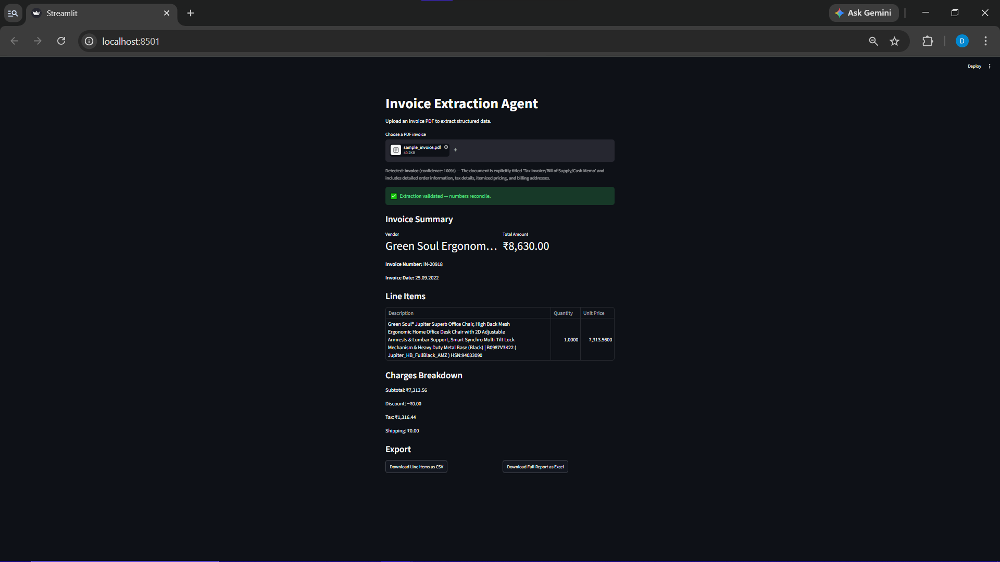
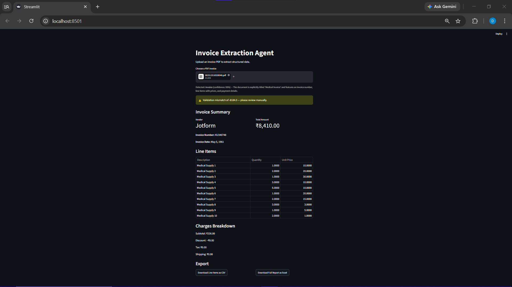
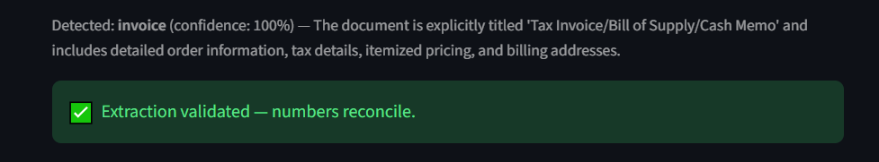
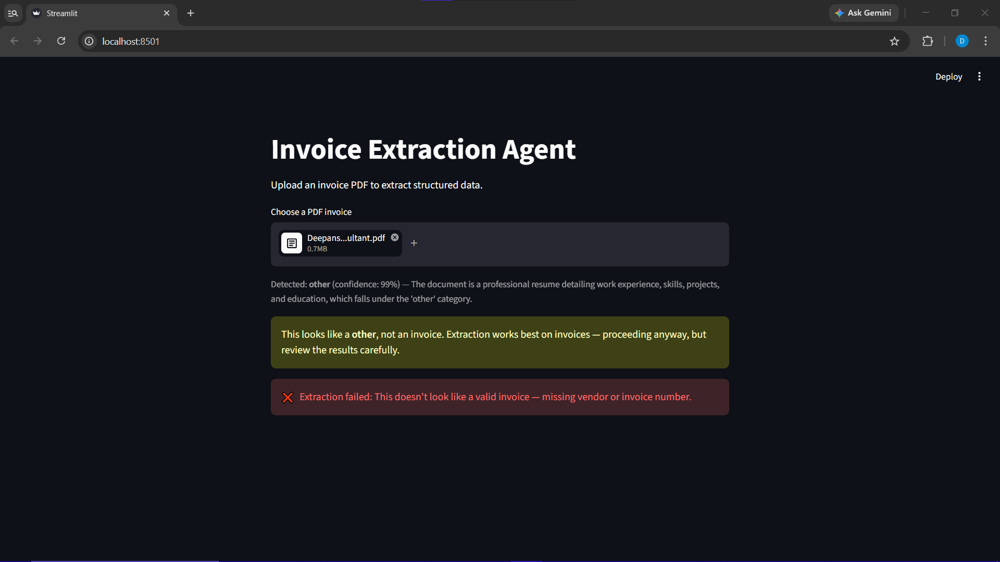

# Invoice Extraction Agent

An AI-powered pipeline that classifies, extracts, validates, and exports structured data from invoice PDFs — built with Google's Gemini API, Pydantic, and Streamlit.

## What it does

Upload any invoice PDF and the app will:
1. **Classify** the document type (invoice, receipt, purchase order, or other) before doing any extraction
2. **Extract** structured data — vendor, invoice number, date, line items, subtotal, discount, tax, shipping, and total — using a strict schema, not freeform text
3. **Validate** the extraction independently by recalculating the total from its parts and flagging any mismatch, rather than trusting the model's own numbers
4. **Export** the results as CSV or a two-sheet Excel report

## Why this project

Most invoice-extraction demos stop at "upload a file, get JSON back." This one is built around a question real finance/AP teams actually care about: **can you trust the output?** The validation and classification layers exist specifically to catch cases where the model is wrong, uncertain, or being fed a document it shouldn't process at all.

## Screenshots

| Successful extraction | Validation catching a real error |
|---|---|
|  |  |

| Classification in action | Non-invoice correctly rejected |
|---|---|
|  |  |

## Architecture

classifier.py → Classifies document type before extraction (invoice / receipt / PO / other)
invoice_extractor.py → Core extraction engine: schema-constrained extraction + reconciliation validation
streamlit_app.py → UI layer, orchestrates classification → extraction → display → export

Extraction logic is fully decoupled from the UI, so it can be reused by any future interface (API, batch script, etc.) without changes.

## A real edge case it caught

While testing, the app was given an invoice where the printed "Total Amount" (₹8,410) didn't match the sum of its own line items (₹226). Rather than trusting the printed total, the app's independent reconciliation check flagged the mismatch for manual review — catching a genuine error in the source document itself.

## Tech stack

- **Gemini API** (`gemini-3.6-flash`) — vision-based extraction directly from PDF, no OCR step needed
- **Pydantic** — schema-constrained structured output, including nested line items and enum-based classification
- **Streamlit** — UI
- **Pandas + openpyxl** — CSV and multi-sheet Excel export

## Running it locally

1. Clone the repo and create a virtual environment:

python -m venv venv
.\venv\Scripts\Activate.ps1
pip install -r requirements.txt

2. Create a `.env` file in the project root:

GEMINI_API_KEY=your_key_here
Get a free key at [Google AI Studio](https://aistudio.google.com/apikey).

3. Run the app:

streamlit run streamlit_app.py

## Known limitations

- Free-tier Gemini quota is 20 requests/day per model — sufficient for demo/testing, not production volume
- Tested primarily on e-commerce and service invoices; layouts with heavy handwriting or poor scan quality haven't been stress-tested
- Currency formatting is hardcoded to ₹ (INR) in the UI

## Roadmap

- [ ] Batch processing (multiple invoices at once)
- [ ] Persistent storage (database) for processed invoices
- [ ] Configurable currency